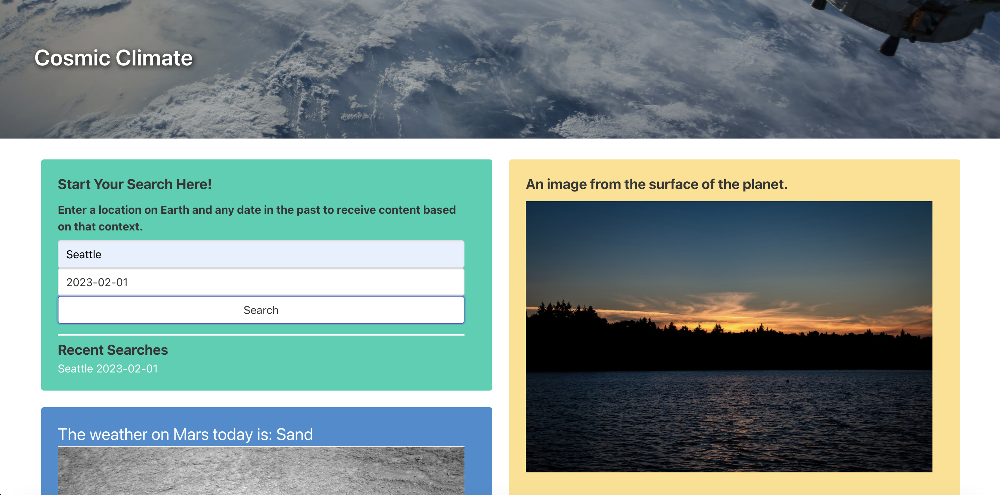

# Cosmic-Climate
Cosmic Climate is an application providing you with a city's weather data, even if you are curious about the historical weather. Cosmic Climate is the best choice for you, in addition you will get space information, along with photos, on any chosen date straight from NASA!

## User Story

```
AS A user
I WANT to see the current weather for multiple cities and have the ability to choose past dates and check its historical weather, in addition, I want to get space information and astronomy photos from NASA.
```

## Acceptance Criteria

```
GIVEN a weather and astronomy dashboard with form inputs
WHEN I search for a city and a specific date
THEN I am presented with weather details of the city on the chosen date and the city and date are added to the search history
WHEN I view the dashboard
THEN I am presented with a random image for that city, an astronomy photo of the day, a rover photo of the day, and the closest asteroid to Earth for that day
WHEN I search a historical date
THEN I am also presented with the moonrise and moonset time for the location on the chosen date
```

## Way to use it:
All you need to do is to write city name and choose required date at (Start Your Search Here!) section and press on Search button.

## Mock-up
 Cosmic Climate App webpage URL:

[Live Link to Deployed Application](https://dingbat-weasel.github.io/Cosmic-Climate//)

The following image demonstraites how the Cosmic Climate App looks once once the user navigates to the live page.


